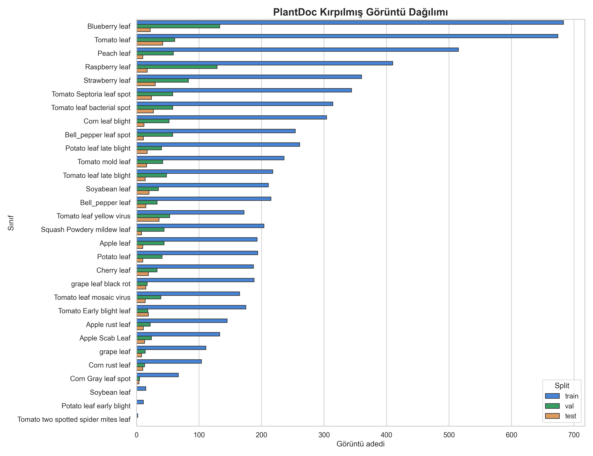
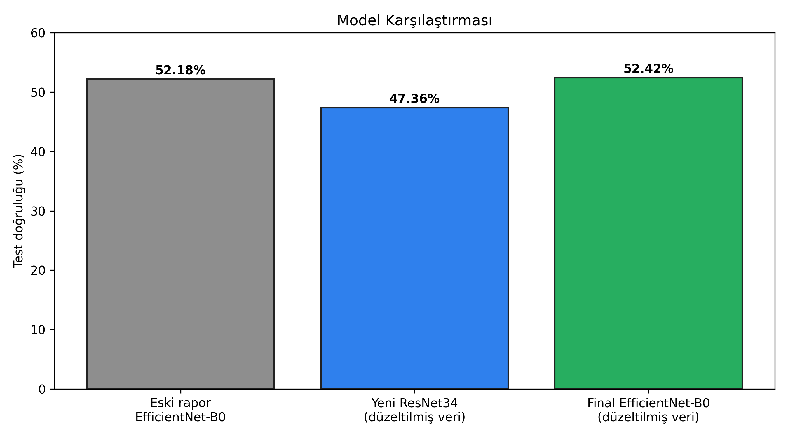
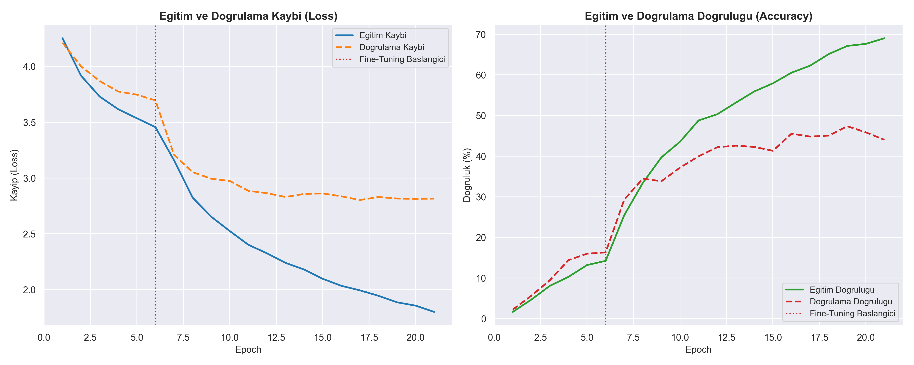

# Derin Öğrenme Dersi - Bitki Yaprağı Hastalığı Sınıflandırma Projesi

**Hazırlayan:** Yusuf Enes Budak  
**Konu:** PlantDoc veri seti ile bitki yaprağı hastalığı sınıflandırma

---

## Projenin Amacı

Bu proje, bitki yaprağı görüntülerinden 30 farklı sınıfı tanımaya çalışan bir derin öğrenme hattıdır. İlk sürümde özel CNN, transfer öğrenme ve Optuna denemeleri birlikte kullanılmıştı. Yeni sürümde Optuna süreci ana akıştan çıkarıldı; veri seti doğrulandı, kırpma hatası düzeltildi ve transfer öğrenme odaklı daha sade bir eğitim/değerlendirme yapısı kuruldu.

Final pratik öneri: **EfficientNet-B0 checkpointi**, düzeltilmiş test setinde **%52.42 test doğruluğu** verdiği için bu veri üzerinde ResNet34 denemesinden daha iyi sonuç verdi.

---

## Veri Seti Kontrolü

Yerel dosyalardaki `data.yaml` ve README metadata bilgilerine göre veri seti **PlantDoc Roboflow Universe v1** exportudur:

- Kaynak metadata: `https://universe.roboflow.com/joseph-nelson/plantdoc/dataset/1`
- Sınıf sayısı: 30
- Ham görüntü sayısı: train 1979, valid 349, test 239
- Ham label dosyaları: train 1979, valid 349, test 239
- Eksik label: 0
- Sahipsiz label: 0
- Geçersiz YOLO satırı: 0

Not: Projede yerel olarak Kaggle metadata dosyası bulunmuyor. Bu yüzden “Kaggle’dan indirildi” bilgisi dosyalardan doğrulanamıyor; mevcut kanıt veri setinin Roboflow PlantDoc exportu olduğunu gösteriyor.

Kırpma sonrası oluşan görüntü sayıları:

- train: 7065 kırpılmış görüntü
- val: 1256 kırpılmış görüntü
- test: 454 kırpılmış görüntü

Val/test içinde 3 sınıfta örnek yok: `Potato leaf early blight`, `Soybean leaf`, `Tomato two spotted spider mites leaf`. Bu nedenle bu sınıfların test metrikleri 0 destekli görünüyor ve macro ortalamayı aşağı çekiyor.



---

## En Önemli Düzeltme

Ön işleme kodunda YOLO kutularını kırparken `ymax` hesabında yanlış eksen kullanılıyordu:

```python
ymax = min(img_h, int(y_center_px + h_px / 2))
```

Önceki sürümde `y_center_px` yerine `x_center_px` kullanıldığı için bazı yaprak kırpıntıları dikey eksende hatalı oluşabiliyordu. Bu hata düzeltildi ve veri yeniden kırpıldı. Bu düzeltmeden sonra test kırpıntı sayısı 412 yerine 454 oldu; bu yüzden eski ve yeni skorlar birebir aynı test kümesiyle kıyaslanmamalıdır.

---

## Model Deneyleri ve Sonuçlar

| Deney | Veri durumu | Test doğruluğu | Not |
|---|---:|---:|---|
| Eski EfficientNet-B0 raporu | Eski kırpma | %52.18 | Önceki rapordaki sonuç |
| Yeni ResNet34 | Düzeltilmiş kırpma | %47.36 | İki aşamalı fine-tuning yapıldı |
| Final EfficientNet-B0 | Düzeltilmiş kırpma | **%52.42** | En iyi pratik sonuç |



ResNet34 denemesi beklenen artışı sağlamadı. Buna rağmen proje için faydalı oldu; çünkü düzeltilmiş veriyle daha doğru bir test seti üzerinde denenmiş oldu. Final kullanımda EfficientNet-B0 daha dengeli sonuç verdi.



---

## Yeni Akışta Yapılan Değişiklikler

- Optuna ana eğitim akışından çıkarıldı; `--optimize` artık sadece bilgilendirme mesajı verir.
- Varsayılan model `resnet34` yapıldı, fakat final raporda en iyi sonuç veren `efficientnet_b0` önerildi.
- İki aşamalı transfer öğrenme varsayılan hale getirildi.
- ResNet sınıflandırıcı başlığına dropout eklendi.
- Eğitimde class-weighted CrossEntropyLoss, label smoothing ve gradient clipping kullanıldı.
- Eğitim veri artırma güçlendirildi: RandomResizedCrop, RandomAffine, RandomAutocontrast ve RandomErasing eklendi.
- Veri denetimi için `--audit_data` seçeneği ve `src/data_audit.py` eklendi.
- Yeni görseller üretildi: veri denetimi, ResNet34 eğitim eğrisi, model karşılaştırması, confusion matrix ve tahmin örnekleri.

---

## Güncel Görseller

Sınıf dağılımı:


Model karşılaştırması:


Hata matrisi:


Test tahmin örnekleri:


---

## Kurulum

Windows sanal ortamı kullanılıyorsa:

```bash
.venv\Scripts\activate
pip install torch torchvision matplotlib seaborn scikit-learn tqdm pandas pyyaml pillow
```

WSL içindeki sistem Python ortamında `torch` ve bazı paketler yüklü olmayabilir. Bu projede başarılı çalışma `.venv\Scripts\python.exe` ile doğrulandı.

---

## Kullanım

Veriyi yeniden kırpmak ve denetlemek:

```bash
python main.py --preprocess --audit_data
```

ResNet34 iki aşamalı eğitim ve değerlendirme:

```bash
python main.py --model resnet34 --train --evaluate
```

Final önerilen EfficientNet-B0 checkpointini değerlendirme:

```bash
python main.py --model efficientnet_b0 --evaluate
```

Tek aşamalı eğitim istenirse:

```bash
python main.py --model resnet34 --train --single_stage
```

---

## Çıktılar

- En iyi ResNet34 checkpointi: `checkpoints/best_resnet34.pth`
- ResNet34 ilk aşama checkpointi: `checkpoints/best_resnet34_stage1.pth`
- Final sınıflandırma raporu: `plots/classification_report.txt`
- Veri denetim raporu: `plots/data_audit_report.txt`
- Eğitim grafiği: `plots/training_curves_resnet34.png`
- Karşılaştırma grafiği: `plots/model_comparison.png`
- Hata matrisi: `plots/confusion_matrix.png`
- Tahmin örnekleri: `plots/prediction_samples.png`
