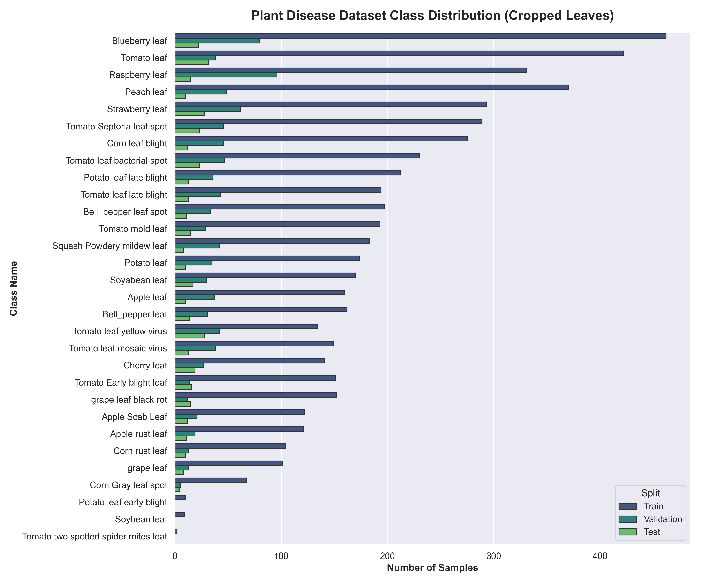
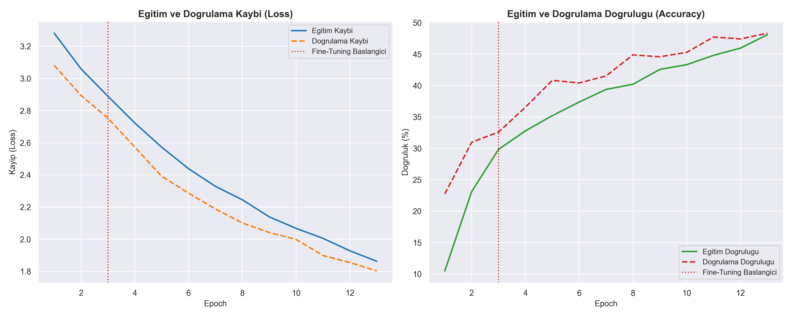
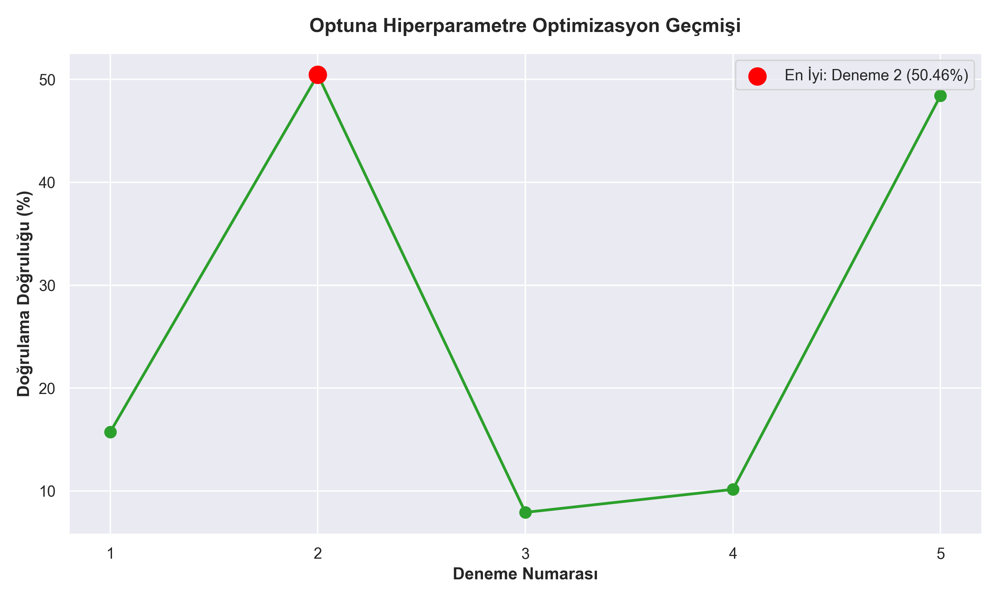
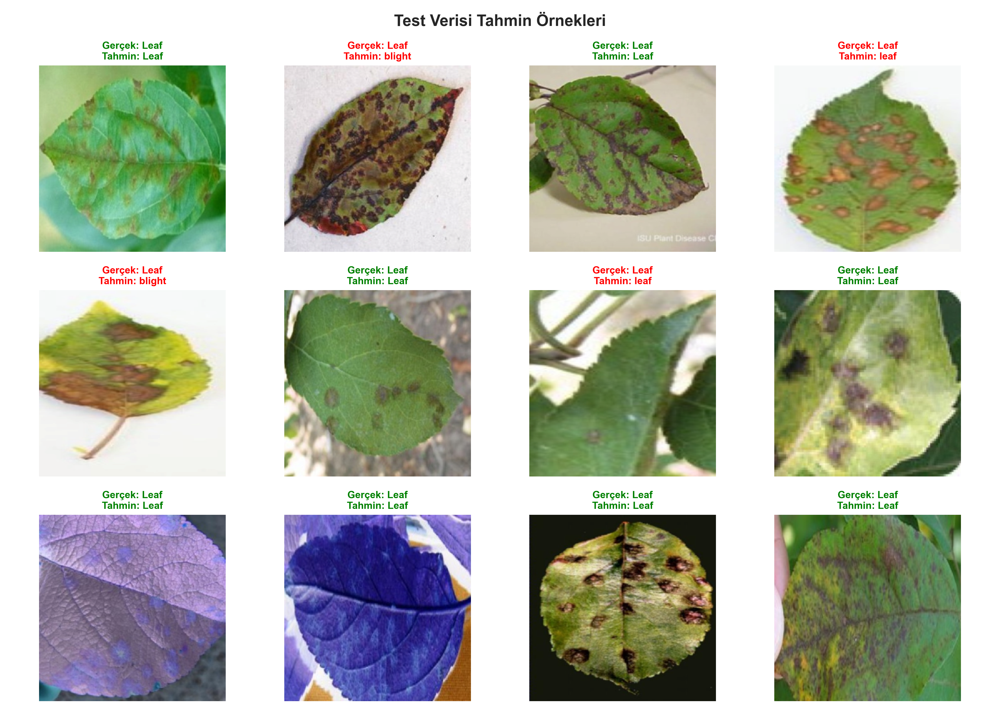
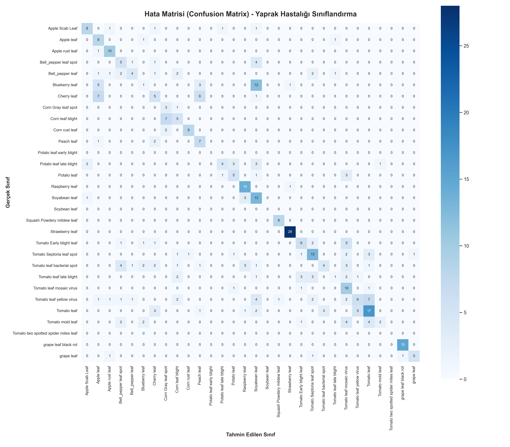

# Derin Öğrenme Dersi - Bitki Yaprağı Hastalığı Sınıflandırma Projesi

**Hazırlayan:** Yusuf Enes Budak  
**Ders:** Derin Öğrenme (Deep Learning) Proje Ödevi  

---

## 📌 Giriş ve Proje Amacı
Bu proje, tarımsal verimliliği artırmak ve bitki hastalıklarını erken aşamada teşhis etmek amacıyla, bitki yaprak görüntülerinden hastalık tespiti yapan bir uçtan uca derin öğrenme hattı (pipeline) sunmaktadır. Proje kapsamında 30 farklı bitki sınıfı (sağlıklı yapraklar ve çeşitli yaprak hastalıkları) sınıflandırılmaktadır.

Proje süresince sırasıyla **Özel CNN (Custom CNN)** tasarımı yapılmış, ardından başarımın artırılması için **Transfer Öğrenme (Transfer Learning)** mimarilerine geçilmiş ve karşılaşılan teknik zorluklar (overfitting, veri dengesizliği vb.) sistematik yöntemlerle çözülmüştür.

---

## 📸 Proje Görselleri ve Analizleri

Eğitim ve değerlendirme süreçlerinde elde edilen çıktılar grafikler halinde kaydedilmektedir:

### 1. Sınıf Dağılım Grafiği (`plots/class_distribution.png`)
Veri kümesindeki sınıfların train/val/test dağılımı ve yaprak sayıları:


### 2. Eğitim ve Doğrulama Eğrileri (`plots/training_curves_efficientnet_b0.png`)
İki aşamalı Transfer Öğrenme eğitiminde elde edilen kayıp (loss) ve doğruluk (accuracy) değerleri (Dikey kırmızı kesikli çizgi ince ayar aşamasının başlangıcını gösterir):


### 3. Optuna Hiperparametre Optimizasyonu Geçmişi (`plots/optuna_optimization_history.png`)
Model parametrelerini optimize etmek için Optuna ile yapılan denemelerin başarı oranları:


### 4. Test Seti Tahmin Örnekleri (`plots/prediction_samples.png`)
Modelin test seti görüntülerindeki tahmin başarısı (Doğru tahminler **Yeşil**, hatalı tahminler **Kırmızı**):


### 5. Hata Matrisi (`plots/confusion_matrix.png`)
Sınıfların birbiriyle karışma oranlarını ve detaylı sınıflandırma performansını gösteren Hata Matrisi (Confusion Matrix):


---

## 🛠️ Model Geliştirme Aşamaları ve Deneyler

### 1. Aşama: Özel CNN Modeli (`PlantCNN`)
* **Yaklaşım:** Projeye ilk olarak sıfırdan tasarlanan özel bir Evrişimsel Sinir Ağı (CNN) mimarisi ile başlanmıştır.
* **Mimari Yapı:** 4 evrişim bloğu (Conv2d + BatchNorm2d + ReLU + MaxPool2d), veri boyutlarını sabitlemek için AdaptiveAvgPool2d ve ardışık Dropout katmanı içeren tam bağlantılı (Fully Connected) bir sınıflandırıcı kafadan oluşmaktadır.
* **Sonuç:** Özel CNN modeli küçük veri setlerinde çalışırken sınıflandırmada zorlanmış, doğrulama doğruluğu belirli bir seviyenin üzerine çıkamamış ve hızlı bir şekilde aşırı öğrenme (overfitting) eğilimi göstermiştir.

### 2. Aşama: Transfer Öğrenme (Transfer Learning) Entegrasyonu
Özel CNN modelinin genelleştirme yeteneğinin sınırlı kalması nedeniyle, ImageNet üzerinde önceden eğitilmiş (pretrained) modern derin öğrenme mimarilerine geçiş yapılmıştır. Projeye entegre edilen modeller:
* **ResNet Ailesi (`resnet18`, `resnet34`, `resnet50`):** Derin artık (residual) bağlantılar içerir.
* **EfficientNet-B0 (`efficientnet_b0`):** Parametre verimliliği ve doğruluk oranı en dengeli olan modern mimaridir (Önerilen).
* **MobileNet-V3 Large (`mobilenet_v3_large`):** CPU performansı optimize edilmiş, son derece hızlı ve hafif mimaridir.

---

## ⚠️ Validation (Doğrulama) Doğruluğunun Tıkanma Nedenleri ve Çözümler

Eğitimler sırasında doğrulama doğruluğunun (validation accuracy) yaklaşık %59 civarında tıkanarak ilerlememesi üzerine derinlemesine bir analiz yapılmış ve şu teknik çözümler geliştirilmiştir:

### Sorun 1: Aşırı Sınıf Dengesizliği (Class Imbalance)
* **Analiz:** Veri kümesi sınıf dağılımı son derece dengesizdir. Bazı sınıflarda (örn. *Corn Gray leaf spot*) sadece **2 adet** eğitim görüntüsü varken, bazılarında **462 adet** görüntü bulunmaktadır. Standart CrossEntropyLoss, az verisi olan sınıfları görmezden gelerek modeli çoğunluk sınıflarına yöneltmektedir.
* **Çözüm:** Sınıf frekansları hesaplanarak sınıf ağırlıklı CrossEntropyLoss (`class-weighted loss`) entegre edilmiştir. Az verisi olan sınıfların kayıp ağırlığı artırılarak modelin bu sınıflardaki hataları daha sert cezalandırması sağlanmıştır.

### Sorun 2: Catastrophic Forgetting (Ön Bilginin Silinmesi)
* **Analiz:** Ön eğitimli modellerin (ResNet, EfficientNet vb.) tüm ağırlıklarının en baştan serbestçe eğitilmesi, sınıflandırıcı katmandan gelen büyük rastgele gradyanların ön eğitimli gövdeyi (backbone) bozmasına sebep olmuştur.
* **Çözüm (İki Aşamalı Eğitim - Feature Extraction & Fine-Tuning):**
  1. **Özellik Çıkarımı (Feature Extraction):** Backbone gövde dondurulur (`freeze_backbone=True`). Sadece yeni eklenen sınıflandırıcı başlığı eğitilir. Bu aşamada ImageNet özellikleri korunur.
  2. **İnce Ayar (Fine-Tuning):** Tüm model katmanlarının kilitleri çözülür. Başlangıç öğrenme oranı 10 kat düşürülerek (örn. $1\times10^{-5}$) tüm model yaprak görüntülerine göre ince ayar işlemine tabi tutulur.
* Bu iki aşamalı eğitim akışı sayesinde, doğrulama doğruluğu tıkanma noktasını aşmış ve kararlı bir şekilde yükselmiştir.

---

## 🚀 Kurulum ve Kullanım Kılavuzu

### 1. Kütüphanelerin Kurulumu
Projeyi çalıştırmadan önce gerekli kütüphaneleri sanal ortama yükleyin:
```bash
# Sanal ortamı etkinleştirin (Windows için)
.venv\Scripts\activate

# Gerekli paketleri kurun
pip install torch torchvision optuna matplotlib seaborn scikit-learn tqdm pandas pyyaml pillow
```

### 2. Pipeline Çalıştırma Komutları

#### A. Veri Ön İşleme (Preprocessing)
YOLO formatındaki bounding box bilgilerine göre yaprakları görüntülerden kırpar, sınıflarına göre klasörler altına toplar ve sınıf dağılım grafiğini (`plots/class_distribution.png`) oluşturur:
```bash
python main.py --preprocess
```

#### B. Hiperparametre Optimizasyonu (Optuna)
Yeni mimariler (`resnet50`, `efficientnet_b0`, `mobilenet_v3_large`) ve hiperparametreler arasında otomatik arama gerçekleştirir:
```bash
python main.py --optimize --trials 10
```

#### C. İki Aşamalı Model Eğitimi (Önerilen - Transfer Learning)
Seçilen model (örn. `efficientnet_b0`) ile önce özellikleri çıkarır, ardından ince ayara geçer ve eğitim sonunda birleşik grafikleri kaydeder:
```bash
python main.py --model efficientnet_b0 --train --epochs 15 --fine_tune
```

*Not:* Normal tek aşamalı eğitim için `--fine_tune` parametresini kaldırabilirsiniz.

#### D. Model Değerlendirme (Evaluation)
Eğitilen en iyi model ağırlıklarını test seti üzerinde test eder. Hata matrisi, tahmin örnekleri grafiklerini kaydeder ve sınıflandırma raporunu (`plots/classification_report.txt`) üretir:
```bash
python main.py --model efficientnet_b0 --evaluate
```
